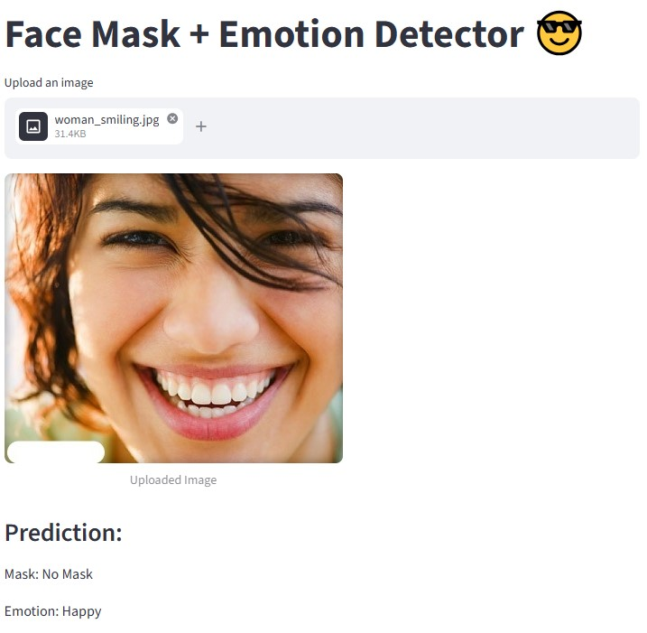

# Face Mask & Emotion Detection

A real-time system for **face mask detection** and **emotion recognition** using deep learning.

This project combines computer vision and deep learning to detect whether a person is wearing a mask and classify their emotion in real-time using a webcam or image input.

---

## Features

* ✅ Real-time face detection using MTCNN
* ✅ Face mask classification (With Mask / Without Mask)
* ✅ Emotion recognition (Happy / Neutral)
* ✅ Multi-task learning (single model for two tasks)
* ✅ Streamlit interactive web UI
* ✅ FPS counter for performance monitoring
* ✅ Webcam and image input support

---

## Demo

Below is a snapshot of the Streamlit web interface:

<p align="center">
  
</p>

---

## Model Architecture

* Backbone: MobileNetV2
* Multi-task learning:

  * Task 1: Mask detection (2 classes)
  * Task 2: Emotion recognition (2 classes)
* Loss: CrossEntropyLoss (separate for each task)

---

## Dataset

### 1. Face Mask Dataset

* Source: Kaggle
* Name: **Face Mask Detection Dataset**
* Structure:

  * `with_mask/`
  * `without_mask/`
* Total images: 7,553 (≈3750 per class)

---

### 2. Emotion Dataset

* Source: https://github.com/muxspace/facial_expressions
* CSV-based labeled dataset

used classes:

* Happy → label 0

* Neutral → label 1

* Total images: 12,564 (after filtering)

---

## Installation

```bash
git clone https://github.com/MahdisHassani/face-mask-emotion-detector.git
cd face-mask-emotion-detector

pip install -r requirements.txt
```

---

## Usage

### 🔹 1. Train the model

```bash
python train.py
```

* Trains multi-task model (mask + emotion)
* Saves best model automatically

---

### 🔹 2. Run webcam inference

```bash
python inference_webcam.py
```

* Opens webcam
* Detects face, mask, and emotion
* Shows FPS in real-time

---

### 🔹 3. Run Streamlit UI

```bash
streamlit run app/streamlit_app.py
```

* Upload image
* Interactive UI
* Real-time predictions

---

## Results

| Metric    | Score |
|----------|------|
| Mask Accuracy     | 98.80% |
| Emotion Accuracy     | 93.23% |

---
